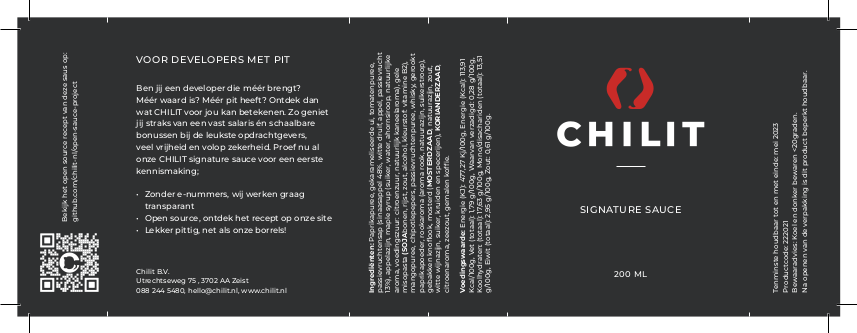

# CHILIT Signature Sauce

The CHILIT Signature Sauce is a complex, and tasty sauce that has something of everything: Smokiness from the paprika powder and the liquid smoke, umami from the miso paste, sweetness from the onions and the maple syrup and a small hint of acidity from the passion fruit. It is perfect with some typical Dutch deep-fried fingerfood!    

## Label

## Ingredients

* 9 red bell peppers
* 3 medium onions
* 12ml Makers Mark
* 9ml liquid smoke
* 1ml lemon extract
* 90g passion fruit purée
* 60g tomato paste
* 45g apple cider vinegar
* 30g maple syrup
* 30g yellow miso paste
* 24g chipotle morita
* 9g smoked paprika powder
* 3g mustard
* 3g small clove garlic
* 2g ground coriander seeds
* 1g ground coffee
* 1g sea salt

## Method

1. Fry the bell peppers in a small amount of oil on high heat until there are some black spots on the peel of the bell peppers. Put them in a blender and blend until smooth.
2. Put the bell peppers back in the pan and let it thicken until it has the same consistency as the tomato paste
3. Finely slice the chipotle peppers
4. Thinly slice the onion and fry in a small amount of oil on low to medium heat until they are very dark and caramelized
5. Add the tomato paste to the onions and let it fry a little until the sourness is gone in the tomato paste
6. Add the bell pepper paste you made before to the pan
7. Add the Makers Mark to the pan until the alcohol is completely evaporated 
8. Add the other ingredients, mix well until homogeneous, and let it thicken to your own preference
